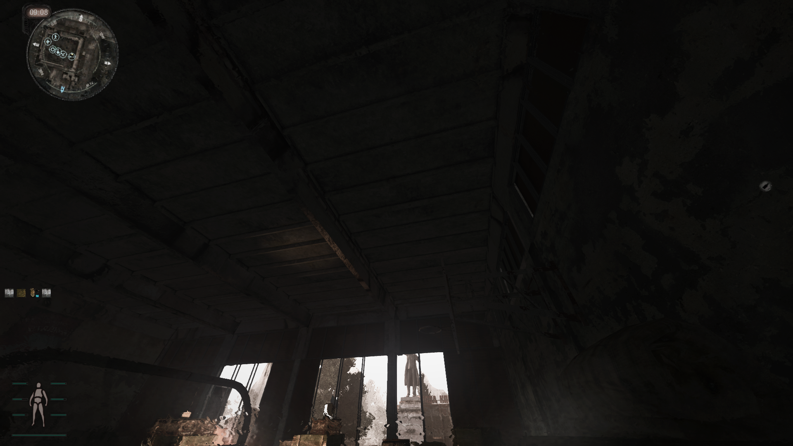

# Stalker-SSAO-mod
modifications of SSDO implementation for Stalker Anomaly

Note: due to github weirdness with diffs with *.ps files, all files are stored as *.hlsl files. You will need to rename *.hlsl -> *.ps to make this work.

Pros:
* SSAO is more visible in general
* SSAO is now visible at distances
* SSAO now affects weapons and other objects close to the screen
* Light contribution is now affected by distance between samples, whereas before it simply was based on depth on the screen.
* Reduced 'bleed' effect of unrealisitc ambient occlusion contribution from objects that were too far in front or too far behind.

Cons:
* Not realistic

## Implementation Details

This shader encodes extra information inside the gbuffers in order to prevent grass contribution to AO (resulting in extremely dark grass). Normally, position.w and normal.w encodes material id and hemisphere information for ambient lighting. These are now packed into a single float inside position.w. Now, normal.w is used to encode extra information used to mask foliage from ambient occlusion contributions. During loading of gbuffer information, this float is unpacked and the extra mask information is added to the returning struct.